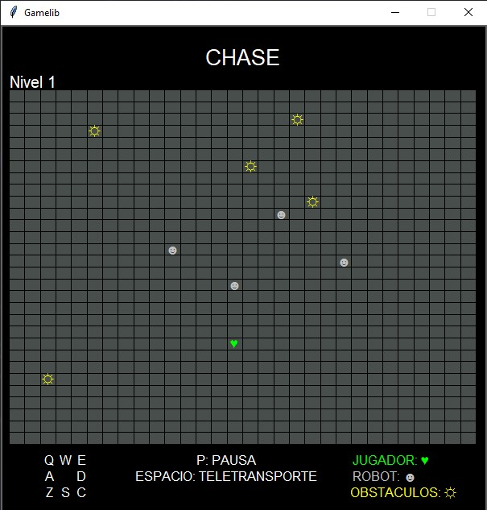
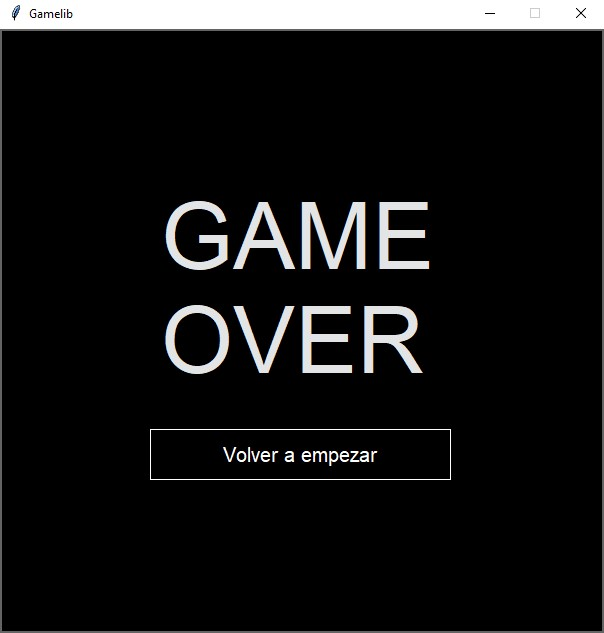

# Chase Game 🏃‍♂️
<p align="justify">
Welcome to <b>Chase</b>, an exciting structured game where players navigate through a maze to avoid being caught by robots. The objective is to make the robots collide with each other or with obstacles to destroy them. Players can also move the obstacles within the maze to create strategic advantages. This project is an implementation of the Chase game in Python, utilizing structured programming principles.
</p>

## 📜 Table of Contents

- [Features](#features)
- [Installation](#installation)
- [Usage](#usage)
- [Game Symbols](#game-symbols)
- [Images](#images)
- [File Structure](#file-structure)
- [Technologies](#technologies)
- [Contributing](#contributing)
- [License](#license)
- [About This Project](#about)

## 🕹️ Features <a name="features"></a>

- Engaging gameplay with maze navigation
- Avoid being caught by robots
- Create collisions between robots or with obstacles to destroy them
- Move obstacles strategically within the maze
- Intuitive graphical interface with keyboard controls

## 🚀 Installation <a name="installation"></a>

To run this project locally, follow these steps:

1. Clone the repository:
   ```bash
   git clone https://github.com/SebaB29/chase.git
   ```

2. Navigate to the project directory:
   ```bash
   cd chase
   ```

3. Run the game:
   ```bash
   python main.py
   ```

## 🎮 Usage <a name="usage"></a>

Use the following controls to play the game:

- **W**: Move up
- **A**: Move left
- **S**: Move down
- **D**: Move right
- **Q**: Move diagonally up-left
- **E**: Move diagonally up-right
- **Z**: Move diagonally down-left
- **C**: Move diagonally down-right
- **P**: Pause
- **Space**: Teleport to a random position

Avoid being caught while trying to create collisions between robots and obstacles!

## ⚙️ Game Symbols <a name="game-symbols"></a>

- **JUGADOR**: "♥" (Player)
- **ROBOT**: "☻" (Robot)
- **OBSTACULO**: "☼" (Obstacle)

## 📷 Images <a name="images"></a>

<div style="display: flex;">
    
    
</div>

## 📁 File Structure <a name="file-structure"></a>

The project structure is as follows:

```
Chase/
├── graphics/
│   ├── gamelib.py
│   └── inter_gráfica.py
├── img/
│   └── [2 demo images of the game]
├── src/
│   └── chase.py
├── main.py
├── .gitignore
├── README.md
├── LICENSE
```

- **graphics/**: Contains libraries for rendering the game (gamelib and graphical logic).
- **img/**: Includes demo images showcasing the game's functionality.
- **src/**: Contains the source code file for game logic (chase).
- **main.py**: The entry point of the application.

## 🛠️ Technologies <a name="technologies"></a>

This project is built with:

- Python
- [Gamelib](https://github.com/dessaya/python-gamelib) (A library created by the instructor to facilitate the use of threads and rendering for the interface)

## 🤝 Contributing <a name="contributing"></a>

Contributions are welcome! If you'd like to improve the game, feel free to fork the repository and submit a pull request.

1. Fork the repository
2. Create your feature branch (`git checkout -b feature/AmazingFeature`)
3. Commit your changes (`git commit -m 'Add some AmazingFeature'`)
4. Push to the branch (`git push origin feature/AmazingFeature`)
5. Open a pull request

## 📄 License <a name="license"></a>

Distributed under the MIT License. See `LICENSE` for more information.

## 📚 About This Project <a name="about"></a>

This project was developed as a practical assignment for university. It aims to implement the Chase game using Python, focusing on game logic and graphical interface through structured programming principles.
