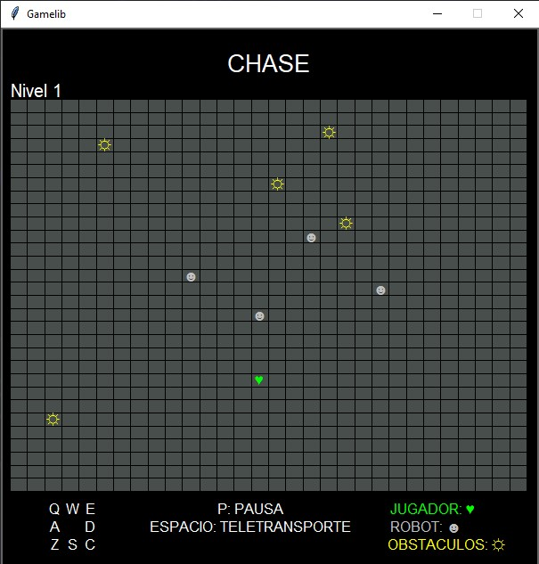
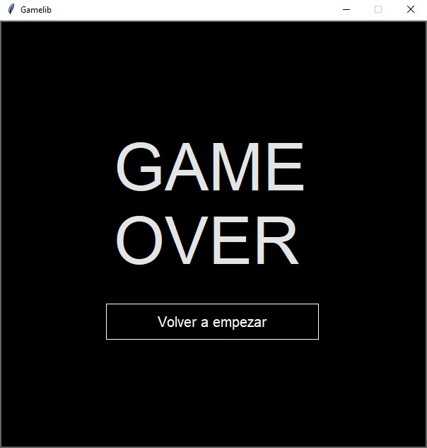

# 🏃‍♂️ Chase Game

Welcome to **Chase**, a strategic survival game where you navigate a maze filled with lethal robots. Your goal is simple but challenging: outsmart the machines by tricking them into colliding with each other or crashing into obstacles. Use your ability to move obstacles and even teleport to survive the mechanical onslaught!

# 📸 Demo
<div align="center">
    
    
</div>

# 📍 Table of Contents
- [📝 Description](#-description)
  - [🧩 Key Features](#-key-features)
  - [🧱 Project Structure](#-project-structure)
  - [🛠️ Technologies](#️-technologies)
- [🚀 Getting Started](#-getting-started)
  - [📋 Prerequisites](#-prerequisites)
  - [⚙️ Installation](#️-installation)
- [💡 Usage](#-usage)
- [🤝 Contributing](#-contributing)
- [📄 License](#-license)

# 📝 Description
Developed as a university project, **Chase** focuses on **structured programming** and grid-based movement logic. It features a tactical environment where every move counts, as the robots move closer to your position with every step you take.

## 🧩 Key Features
- **Tactical Movement:** Full 8-direction movement (orthogonal and diagonal).
- **Movable Obstacles:** Push obstacles strategically to block or destroy robots.
- **Robot AI:** Robots follow the shortest path to the player, allowing for calculated lures.
- **Panic Button:** Use the **Teleport** feature for a random chance at survival when cornered.
- **Collision Physics:** Smart detection for robot-to-robot and robot-to-obstacle destruction.

## 🧱 Project Structure
```text
Chase/
├── graphics/    # UI rendering and Gamelib integration
├── img/         # Gameplay and Game Over screenshots
├── src/         # Core game mechanics (chase.py)
├── main.py      # Entry point
└── LICENSE      # MIT License
```

## 🛠️ Technologies
* **Python 3.x**
* **Gamelib**: A lightweight thread-based rendering library for Python interfaces.

# 🚀 Getting Started
## 📋 Prerequisites
* Python 3.10 or higher installed on your system.

## ⚙️ Installation
1. Clone the repository:
   ```bash
   git clone [https://github.com/SebaB29/chase.git](https://github.com/SebaB29/chase.git)
   cd chase
   ```

# 💡 Usage
To start the game, simply run the main script:
```bash
python main.py
```

You control the Player (♥). Every time you move, the Robots (☻) move one step closer.

## 🎮 Controls
| Key         | Action                |
|-------------|-----------------------|
| W           | Move Up               |
| S           | Move Down             |
| A           | Move Left             |
| D           | Move Right            |
| Q           | Up-Left (Diagonal)    |
| E           | Up-Right (Diagonal)   |
| Z           | Down-Left (Diagonal)  |
| C           | Down-Right (Diagonal) |
| Space       | Teleport              |
| P           | Pause / Resume        |

## ⚙️ Game Entities
* ♥ Player: You!
* ☻ Robot: Destroys you on contact.
* ☼ Obstacle: Can be moved and destroys robots on contact.

# 🤝 Contributing
1. Fork the project.
2. Create your Feature Branch (git checkout -b feature/AmazingFeature).
3. Commit your changes (git commit -m 'Add some AmazingFeature').
4. Push to the Branch (git push origin feature/AmazingFeature).
5. Open a Pull Request.

# 📄 License
This project is licensed under the MIT License - see the LICENSE file for details.
